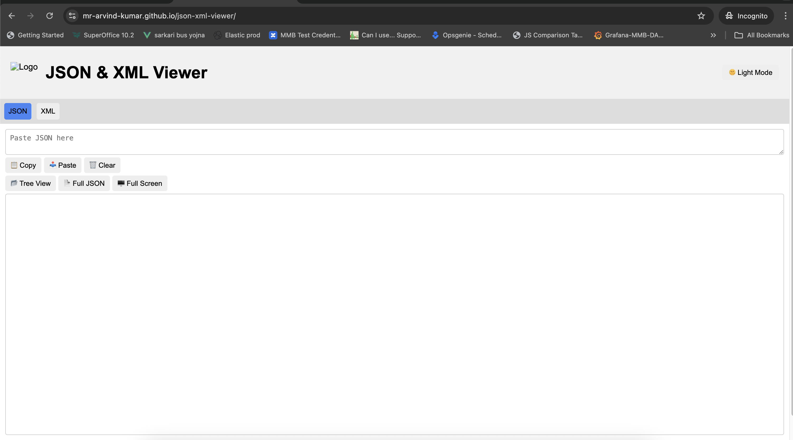

# 📄 JSON & XML Viewer

A modern, responsive, and themeable **JSON/XML Viewer** built with **HTML, CSS, and JavaScript**  
— no frameworks or build tools required, just run in your browser.

It allows you to:

- View JSON in an **expandable/collapsible tree structure**.
- View XML in an **expandable/collapsible tree**.
- Toggle between **Dark & Light themes** instantly.
- Show **Full Raw JSON** in a modal window.
- Toggle **Full Screen** mode for JSON/XML output (with an X to exit).
- **Copy, Paste, and Clear** JSON/XML input boxes with one click.
- Switch between **JSON** and **XML** panels instantly.
- Fully responsive layout with a **beautiful header and footer**.

---

## 📂 Project Structure

## 📂 Project Structure

```text
📦 son-xml-viewer
├── 📄 index.html         # 🌐 Main entry point
├── 🎨 styles.css         # 🎭 Styling (light/dark theme support)
├── ⚙️ script.js          # 🛠️ Global/shared JS (theme toggle, fullscreen, clipboard)
├── 📜 json.js            # 📊 JSON-specific rendering & modal functions
├── 📜 xml.js             # 📂 XML-specific rendering
│
└── 🗂️ assets             # 📎 Static assets
    ├── 🖼️ logo.png       # 🖋️ Optional application logo
    └── 🖼️ screenshot.png # 📷 (Optional) for README screenshot
```


---

## 🚀 Getting Started

### 1️⃣ Download or Clone


git clone https://github.com/Mr-Arvind-Kumar/json-xml-viewer.git
cd json-xml-viewer


Or download the ZIP and extract.

### 2️⃣ Open in Browser
No server or installation needed — just open:

index.html

in any modern browser (Chrome, Edge, Firefox, Safari).

---

## ⚙️ Features

### JSON Panel
- Collapsible **tree view** for easy navigation.
- **Full Raw JSON modal** for quick formatted text version.
- Copy / Paste / Clear action buttons for quick input management.

### XML Panel
- Collapsible **tree view** for XML structure.
- Copy / Paste / Clear action buttons for quick input management.

### Layout & Theming
- **Dark/Light theme toggle**.
- Beautiful header & footer styling.
- Responsive design for desktop and mobile.

### Full Screen & Modal
- One-click **Full Screen** with exit button.
- Modal for full JSON raw view — close via X, ESC key, or background click.

---

## 📸 Screenshot
*(Optional — replace with your own image in `/assets/screenshot.png`)*



---

## 🛠 Customization
- Swap out `/assets/logo.png` for your own logo.
- Edit `styles.css` to change theme colors, branding, or spacing.
- Change initial active panel by updating:


showOnly('json'); // or 'xml'


in `index.html`

---

## 📜 License
MIT License — Free to use, modify, and distribute.

---

## 🤝 Contributing
Pull requests are welcome. For major changes, please open an issue first to discuss your proposal.

---

## 👨‍💻 Author
Built with ❤️ by **[Arvind & friends]**
